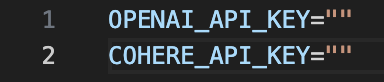

# CyberForge

> Open source cybersecurity assistant powered by LLMs — audit, improve, and secure your organizational policies.

## ✨ Overview

**CyberForge** helps you analyze and improve your company’s cybersecurity policies using large language models (LLMs). Get deep insights aligned with recognized frameworks such as **NIST, CIS Controls,** and **PIPEDA**.

## 🚀 Features

- 🔍 Analyze policies against frameworks like NIST, CIS, and PIPEDA
- 📊 Visual scores for each control and top identified threats
- 📄 Suggested improvements to your uploaded documents
- 🤖 Context-aware agent assistant powered by your own documents
- 🔌 Flexible LLM support (OpenAI, Cohere or any compatible model)

## 🔧 Prerequisites

Before you get started, you’ll need:

| Tool / Requirement                        | Description                                                                                               |
| ----------------------------------------- | --------------------------------------------------------------------------------------------------------- |
| Git                                       | Required to clone the repository: [Git](https://git-scm.com/)                                            |
| OpenAI or Cohere API key                  | OpenAI: [platform.openai.com](https://platform.openai.com/account/api-keys)<br>Cohere: [cohere.com](https://cohere.com/) |
| PDF Policies                              | You'll need your policies in `.pdf` format to analyze. If you don’t have any, sample policies are provided directly in the CyberForge application to use.|


> 📃 If you wish to create your own policies for your organization, templates and government guides are provided in the ***guides*** folder.

## 📦 Cloning the Repository

To clone the repository, navigate to a new terminal instance, and run the following commands.

```bash
git clone https://github.com/tidalpoint/cyberforge.git
cd cyberforge
```

## 🔑 Obtaining an API Key

An API key from either OpenAI or Cohere is a requirement to use CyberForge.

### OpenAI API Keys

To obtain an OpenAI API key, please navigate to the following document for step-by-step instructions.

[](openai.md)

> 💰 Please note that you must purchase credits or add your payment details in order to use OpenAI models.

### Cohere API Keys

To obtain a Cohere API key, please navigate to the following document for step-by-step instructions.

[](cohere.md)

> 💰 Please note that free trial API keys have rate limits, and to use CyberForge to its full potential, a paid production key is required.


## 🐳 Install with Docker

- You will first need to install the Docker Desktop app ([https://www.docker.com/products/docker-desktop/](https://www.docker.com/products/docker-desktop/))

  

### Make sure your API keys are set as environment variables:

- Environment variables allow the operating system to read in the API keys and use them in the application. 

Rename .env.example (located in the root of the project) to .env and add in your API key(s).

  

Fill in the "" portion with the actual API key(s).

  

----- OR -----

Set the environment variables by typing the following commands into a new terminal instance and fill in the "" portion with the actual API key.

```
Windows:
$Env:OPENAI_API_KEY=""

Mac/Linux:
export OPENAI_API_KEY=""
```

### Start with Docker

Once the environment variables are set, run the following command to start the application. 

```bash
docker compose up
```

### App Navigation

- Navigate to [localhost:5173](http://localhost:5173) to see CyberForge in action!

## 🛠️ Install Manually

- You will need to have the following installed:
  - Node.js 20+ ([https://nodejs.org/en/download](https://nodejs.org/en/download))
  - Python 3.12+ ([https://www.python.org/downloads/](https://www.python.org/downloads/))
 
### Same as above, please make sure your API keys are set as environment variables:

Rename .env.example (located in the root of the project) to .env.

  

Fill in the "" portion with the actual API key(s).

  

----- OR -----

Set the environment variables by typing the following commands into a new terminal instance and fill in the "" portion with the actual API key.

```
Windows:
$Env:OPENAI_API_KEY=""

Mac/Linux:
export OPENAI_API_KEY=""
```

- Now, please ensure you are in the root of the project.

Frontend: installs dependencies and starts on [localhost:5173](http://localhost:5173) by default

```bash
npm install -g yarn

cd frontend

yarn
yarn dev
```

- Open a new terminal instance, and ensure you are in the root of the project.

Backend: installs dependencies and starts on [localhost:9009](http://localhost:9009) by default

```bash
cd backend

Windows:
python -m venv .venv
.venv/Scripts/activate

Mac/Linux:
python3 -m venv .venv

source .venv/bin/activate

pip install -r requirements.txt
python app.py
```

### App Navigation

- Navigate to [localhost:5173](http://localhost:5173) to see CyberForge in action!

## 🛠️ Usage

1. **Upload your policies** (PDF only)
   - Don’t have any policies? You can:
     - Demo with our sample documents from a fictitious Finance company “Maple Trust”. Simply click *Use Sample Documents* on the home page of CyberForge.
     - Use our provided policy templates and government guides, located in the in the ***guides*** folder, to create your own policies for your organization.
2. **Select a cybersecurity framework**:
   - NIST CSF
   - SMO Controls
   - CIS Controls
3. **Review outputs**:
   - 🧠 Top Threats
   - 📈 Control Scores - with suggested actions to improve
   - 📑 Suggested document improvements
   - 🍁 PIPEDA Results
   - 💬 Chat with the AI assistant for policy questions
4. **Wish to restart?**
   - Simply navigate back to [localhost:5173/onboarding](http://localhost:5173/onboarding) to restart.
   - Please note that once you restart, the PDFs you've uploaded are reset, and you will have to upload a new set of policies.

> ⚠️ If the frontend or backend process is killed and then started again, the PDFs are also reset, and you will have to upload a new set of policies.

> 📋 Chat history is preserved across sessions and restarts - allowing you to have a comprehensive overview of your chats at all times. 

## 🔩 Switching LLM Models and Providers

> ⚠️ We suggest using OpenAI's GPT-4o and GPT-4o-mini models, and Cohere's Command A and Command R models. However, you can experiment with other OpenAI and Cohere models as you prefer.

- To switch the LLM provider being used, navigate to ```config.py``` and switch the **DEFAULT_PROVIDER** variable to either **openai** or **cohere**.
- Similarly, to switch the LLM being used, navigate to ```config.py``` and switch the ***openai*** or **cohere** entry in the **DEFAULT_MODELS** variable to a model of your choice (e.g. gpt-4o, gpt-4o-mini, command-r, command-r-plus, etc).
  
  
*Figure 1: Onboarding – Upload Documents*

## 📷 Screenshots

  
*Figure 1: Onboarding – Upload Documents*

  
*Figure 2: Onboarding – Select Framework*

  
*Figure 3: Home Page*

  
*Figure 4: Compliance Page*

  
*Figure 5: Control Page*


*Figure 6: Policy Improver*

  
*Figure 7: PIPEDA Results*

  
*Figure 8: Chat Assistant*

## 📣 Additional Info

CyberForge has two other variations, customized to your needs:

- For a simple RAG chat assistant application, Estel, please navigate to the following document to learn how to set it up!

[](estel.md)

- For a lightweight version of CyberForge (without control score analysis) running on a free, self-hosted LLM (Mistral), please navigate to the following repository to set it up!
  
[](https://github.com/tidalpoint/cyberforge-ember)


## 📄 License

MIT ©️ Tidal Point Software
