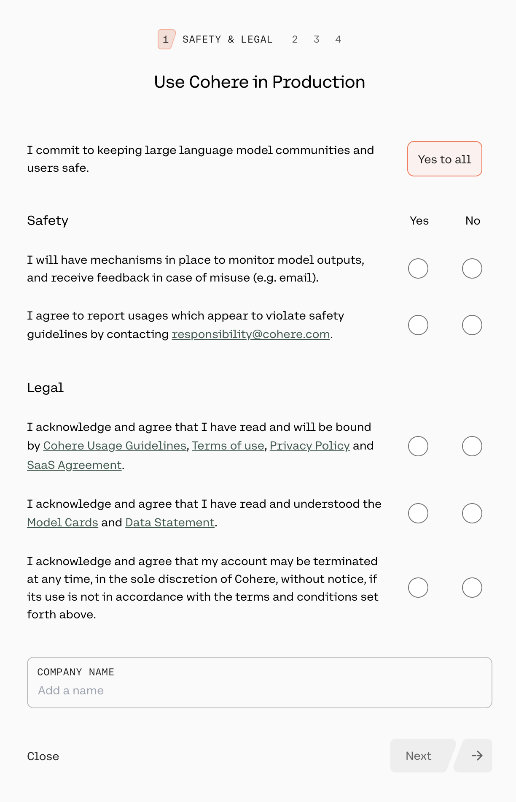

## 🔐 Create a Cohere Account & API Key

Before using CyberForge, you’ll need to create a Cohere account and generate an API key. Follow the steps below to get started:

---

### 🧭 Step 1: Navigate to the Cohere Platform

1. Go to [**cohere.com**](https://www.cohere.com)
2. Click **Sign In** at the top right

 

---

### ✍️ Step 2: Sign Up

* If you **don’t** have an account, select **Sign up** and enter your email and password
* Alternatively, sign in with a partner provider; Google or GitHub

 

*Continue with a partner provider*

 

*Sign up with new account* 

---

### 📩 Step 3: Verify Your Email

*Now, you'll receive an email sent by Cohere to verify your email.

 

* Open your email inbox and click the **Confirm your email** button in the email.

 

---

### 👤 Step 4: Fill Out Profile Info

* Enter your **first and last name**

   

* Select your **role**

   

* Choose how you plan to use Cohere and click **Submit**

   

---

### ⚙️ Step 5: Navigate to the Dashboard

Once you're inside your dashboard:

* Select **API Keys** from the sidebar.

 

---

### 🧪 Step 6: Use a Trial Key (Limited Usage)

* Under the **Trial Keys** section, copy your **free key** to get started with CyberForge right away.

 

---

### 🚀 Step 7: Create a Production Key (Strongly Recommended)

* Click to **create a new Production Key** for higher usage limits. For full compatiability with CyberForge, a production key is strongly recommended.

 

* Answer the onboarding questions:

✅ Select **Yes** to the safety and legal questions, and please input a company name

 

🚫 Select **No** when asked about the following use cases 

 

---

### 💳 Step 8: Add Billing Info

* Enter your **credit card** details to activate your production key.

 

* Name your key and click **Generate Production key** to generate it.

 

---

### 📋 Step 9: Copy and Store Your Key

> ⚠️ **Important:** Once generated, make sure to **copy your key immediately**. You won’t be able to view it again.

 

---

### ✅ You're Ready!

You can now use your Cohere API key in CyberForge and take full advantage of all features!
