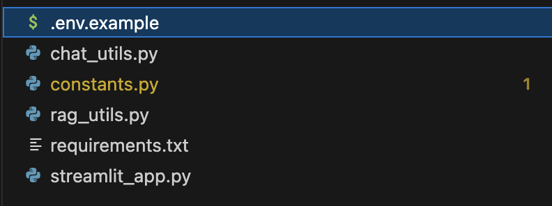
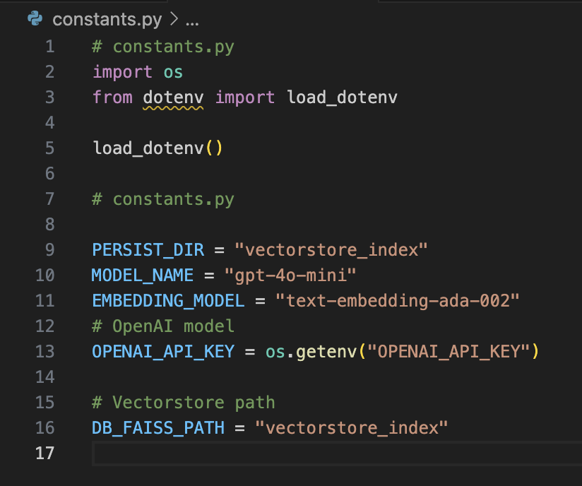
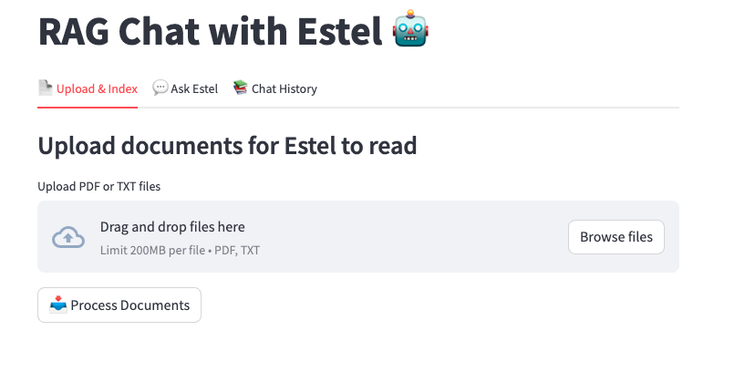
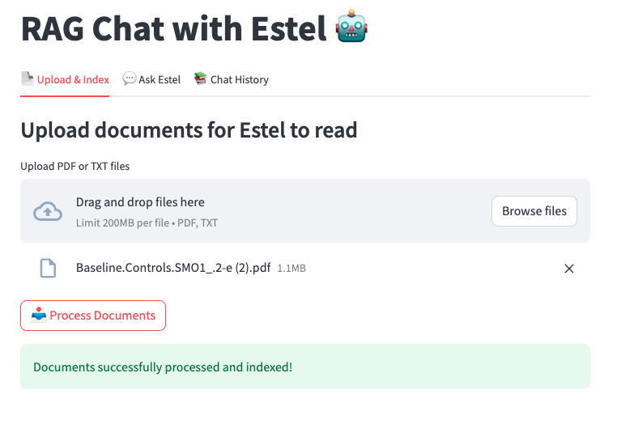
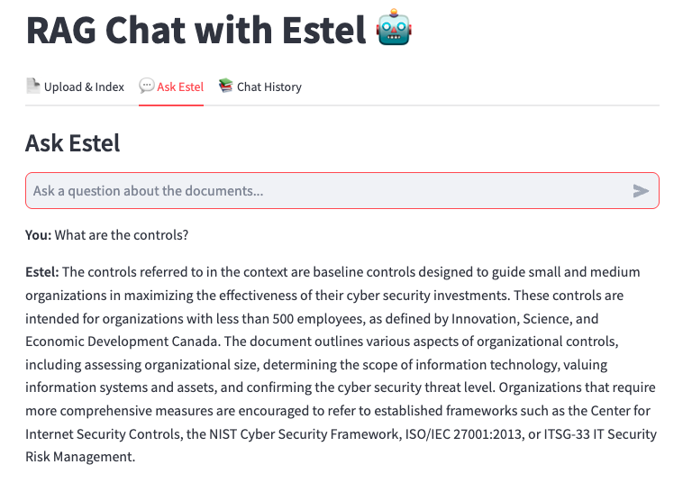
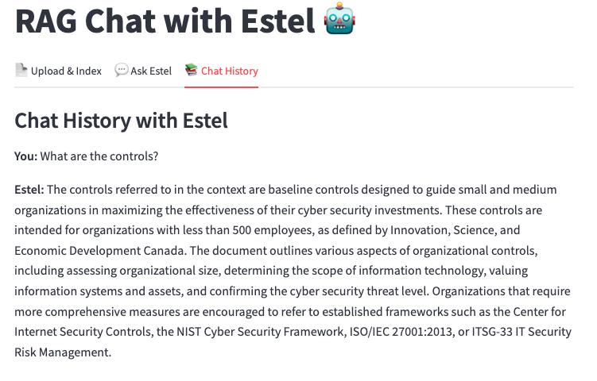

 # ✨ Estel

> Simple RAG chat assistant powered by OpenAI — upload, chat, and audit directly from your docs.

## 🚀 Features

- 🔍 Analyze documents in-depth with contextual understanding
- 🤖 Chat with Estel, a document-aware AI agent
- 📁 Seamless document upload and indexing (PDF + TXT files)
- 🔌 Supports OpenAI models (GPT-4o, GPT-4o-mini, etc)

## 🛠️ Prerequisite

For the Estel sample project, it only supports OpenAI API keys. For more information on how to create an OpenAI API key, please navigate to the following document for step-by-step instructions.

[](openai.md)

> 💰 Please note that you must purchase credits or add your payment details in order to use OpenAI models.

## 🧰 Setup

Please make sure you are in the root of the CyberForge project. We will navigate to the folder that contains Estel.

```bash
cd estel
```

### Make sure your OpenAI API key is set as an environment variable:

Rename .env.example (located in the Estel folder) to .env.

 

Fill in the "" portion with the actual API key.

 

### Starting Estel

Now, we will install the required dependencies and start up Estel. 
```bash
Windows:
python -m venv .venv
.venv/Scripts/activate

Mac/Linux:
python3 -m venv .venv

source .venv/bin/activate

pip install -r requirements.txt
streamlit run streamlit_app.py
```

### App Navigation

Navigate to localhost:8501 to see Estel in action!

## 🛠️ Usage

1. **Upload your documents** (PDF and TXT only)
    - These documents will now serve as part of the RAG.
    - You can always upload more documents by navigating back to the *Upload & Index* tab.
2. **Interact with Estel 💬**:
    - 🧠 Ask questions about your documents
    - 📑 Navigate to the *Chat History* tab to view past chats.

> ⚠️ If the app process is killed and then started again, the documents are reset, and you will have to upload a new set of documents.

> 📋 Chat history is not preserved across sessions - once the app process is killed at all times.


## 🔩 Switching LLM Models and Providers

> ⚠️ We suggest using OpenAI's GPT-4o and GPT-4o-mini models. However, you can experiment with other OpenAI as you prefer.

- To switch the LLM  being used, navigate to ```constants.py``` and switch the **MODEL_NAME** variable to a model of your choice (e.g. gpt-4o, gpt-4o-mini, etc).

 


## 📷 Screenshots



*Figure 1: Home Page + Upload Documents*



*Figure 2: Process Documents*



*Figure 3: Interactive Chat with Estel*



*Figure 4: Chat History*


## 📄 License
MIT ©️ Tidal Point Software
