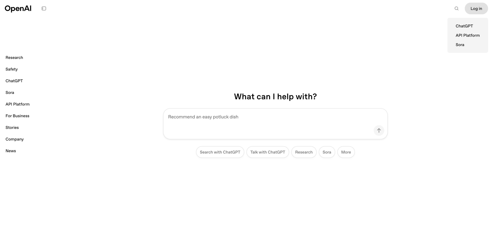
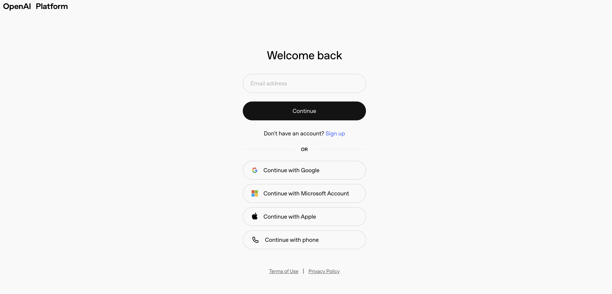
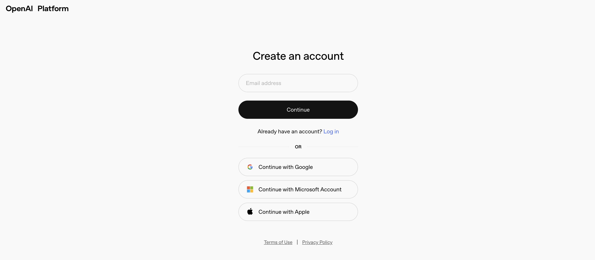
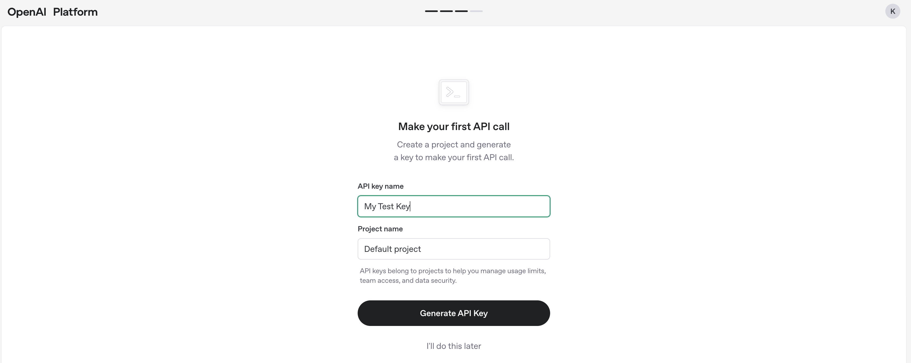
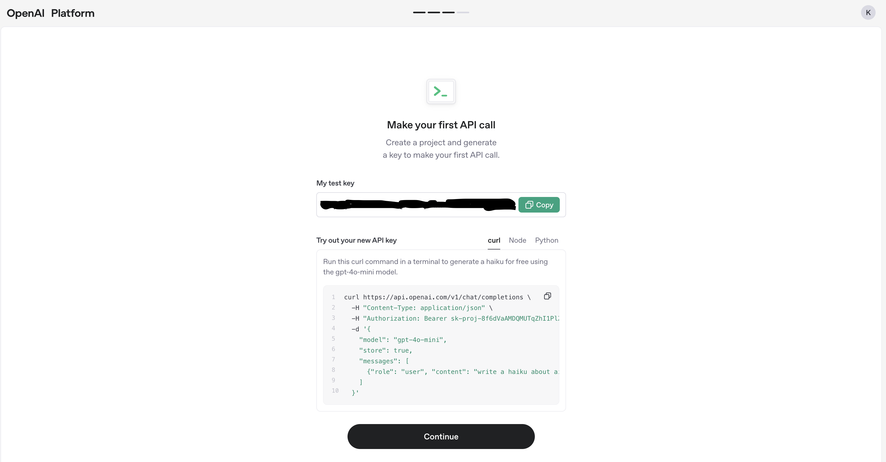
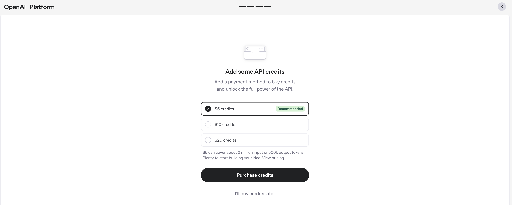
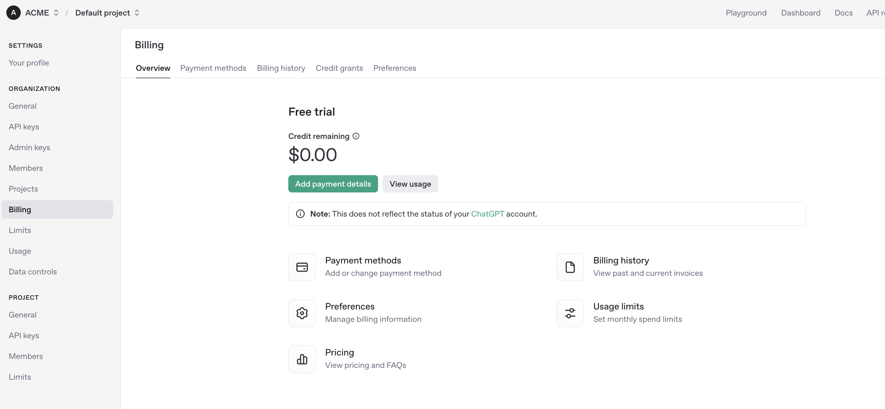
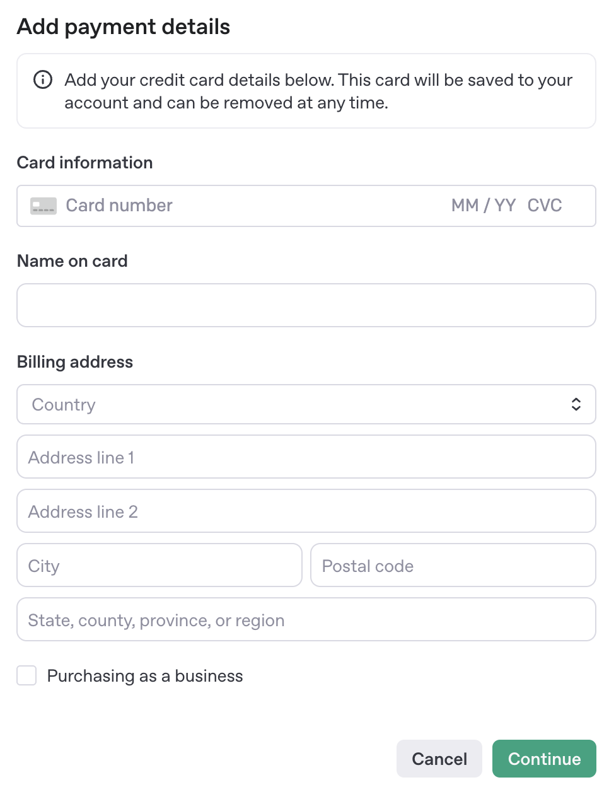

## 🔐 Create an OpenAI Account & API Key

Before using CyberForge, you’ll need to create an OpenAI account and generate an API key. Follow the steps below to get started:

---

### 🧭 Step 1: Navigate to the OpenAI Platform

1. Go to [**openai.com**](https://www.openai.com)
2. Click **Log In** at the top right.
3. In the dropdown, select **API Platform**.

---

### ✍️ Step 2: Sign Up

* If you **don’t** have an account, select **Sign up** and enter your email and password.
* Alternatively, sign in with a partner provider; Google, Microsoft, GitHub, or phone number.

*Continue with a partner provider*

*Sign up with new account* 

---

### 📩 Step 3: Verify Your Email

* Check your inbox for a verification code.
* Enter the code to proceed.

---

### 🧑‍💼 Step 4: Enter Profile Information

* Provide your **full name** and **birth date**.

* Add an **organization name** (can be anything).
* Select an option for “**What best describes you?**”

* Click **Create organization**.
* When prompted to invite your team, select **“Do this later”**.

---

### 🔑 Step 5: Generate Your API Key

1. Give the API key a name, and project name. Afterwards, click **Generate API Key**.

> 📋 **Important:** Copy the API key and store it securely. You won’t be able to view it again once the dialog closes.

---

### 💳 Step 6: Add Billing Details

* You can now purchase credits to begin using the API key, where each invokation of the API key will use your credits.

#### To manage billing details and to add payment options for further usage of the API key:

1. Navigate to **Settings**.

2. Click the **Billing** tab.

3. Click the green **Add payment details** button to input the credit card that will be charged for each subsequent API key invokation.

---

### ✅ You're All Set!

You can now use your OpenAI API key in CyberForge and take full advantage of all features!
